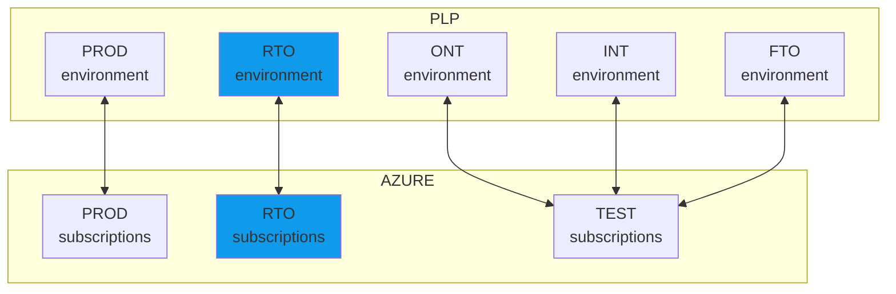

# Restore
Introduction

```mermaid
flowchart TD
    direction LR
    subgraph PLP
        subgraph PLP-ONT["ONT\nenvironment"]
        end
        subgraph PLP-INT["INT\nenvironment"]
        end
        subgraph PLP-FTO["FTO\nenvironment"]
        end
        subgraph PLP-RTO["RTO\nenvironment"]
        end
        subgraph PLP-PROD["PROD\nenvironment"]
        end
    end
    subgraph AZURE
        subgraph AZ-TEST["TEST\nsubscriptions"]
        end
        subgraph AZ-RTO["RTO\nsubscriptions"]
        end
        subgraph AZ-PROD["PROD\nsubscriptions"]
        end
    end

    classDef BLUE fill:#109AEB
    PLP-ONT <--> AZ-TEST
    PLP-INT <--> AZ-TEST
    PLP-FTO <--> AZ-TEST
    PLP-RTO:::BLUE <--> AZ-RTO:::BLUE
    PLP-PROD <--> AZ-PROD
```
