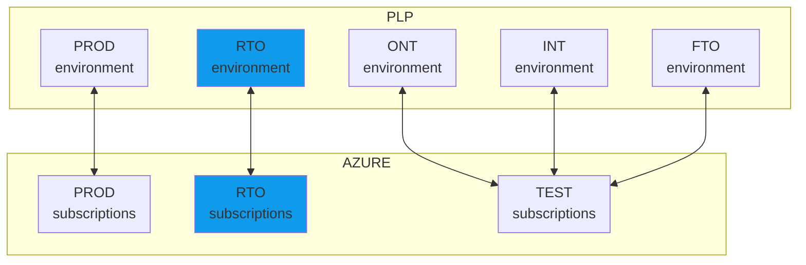

# Infrastructure

## Introduction
The infrastructure to support *restore tests* is named the **Restore Test Omgeving (RTO)**. This environment is available at the **PLP platform (named PLP-RTO)** as well as at the **Azure PLS platform (named PLS-RTO)**.

## Requesting access to the PLP-RTO
Unlike the normal PLP selfservice  
