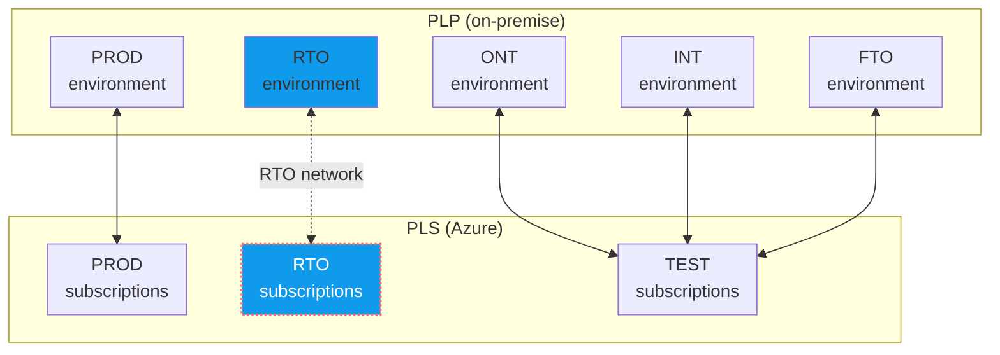

# Infrastructure

## Introduction
The infrastructure to support *restore tests* is named the **Restore Test Omgeving (RTO)**. This environment is/will be made available at the **PLP platform** (named **PLP-RTO**) and the **Azure PLS platform** (named **PLS-RTO**). 

The current status of the RTO environment is:
- The PLP-RTO environment is functionally available and usable. *Access to this new environment must, however, be requested.*
- The PLS-RTO enviroment is currently in the design phase. The PLS platform will be upgraded in the coming months to support this new environment. 
- The RTO network connection between PLP-RTO and PLS-RTO is also in the design phase.

